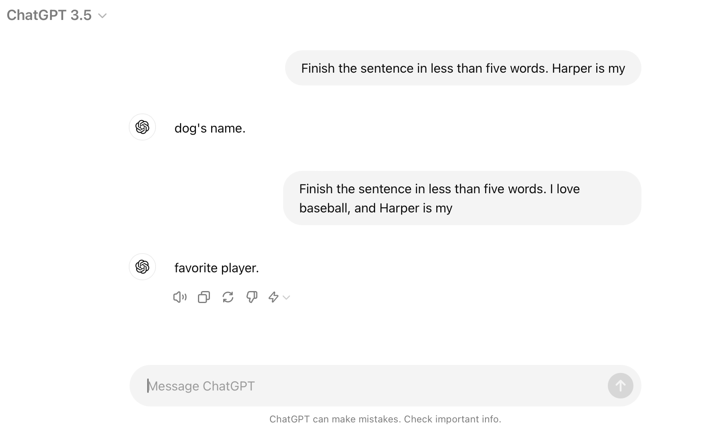

```{r setup, include=FALSE}
knitr::opts_chunk$set(cache = TRUE, fig.align = "center")
library(tidyverse)
```

So far you've learned how to use R to manipulate and visualize data. Understanding the fundamentals of programming (and R specifically) is important for any data scientist - it is a core skill for planning and troubleshooting complex data analyses. However, as you probably know, recent years have seen the rise of powerful machine learning (ML) or artificial intelligence (AI) systems that can be used to automate many language-based tasks. In particular, they are exceptional at writing code. This is partly because code is by design highly structured and consistent, which makes it predictable, and also because there are lots of examples of good code on the internet that the AI can learn from. In this lecture, we'll explore how you can use AI to help you write code - what it's good at, what it's not so good at, and best practices for getting the most out of it.

## Basic concepts for large language models 

Large language models (ChatGPT, Claude, Bard, etc.), or LLM's, are what the name suggests: big neural networks that have been trained on a lot of text data. 

The most important thing to know about these models is that they are trained for **next-word prediction**. This means that they are designed to predict the next word in a sentence given the words that have come before it. They learn this, fundamentally, by "reading" a bunch of text (from the internet) and identifying patterns in the way that words are used together. So, remember, these models are basically adding the next word (or "token") that creates a sentence most like those it has seen on the internet.

There's a lot to talk about here, but the important takeaways are:

1.  The prompt, or context, you give the model is very important. It's what the model uses for pattern matching to predict the next word. The more specific and detailed your prompt, the better the model will be at predicting the next word.
2.  The model is only as good as the data it was trained on. If the model has seen a lot of examples of `X`, it will be good at predicting the next word in `X`. If it hasn't, it won't be as good.



## Using AI to write code

We'll next use AI to help us reproduce some of the code we've written in previous lectures or problem sets more efficiently. We hope that you'll take away a few things from this exercise:

* AI is awesome at remembering / reproducing patterns, so it's great for writing code that follows a template (like many `dplyr` and `ggplot2` functions operations)
* AI will make mistakes if you don't give it enough context or instructions. It's not magic, it's just a big pattern-matching machine.

### Example 1: Data wrangling

Every data analysis project starts with data wrangling, which means that there are lots of repetitive tasks using operations like `filter`, `mutate`, `group_by`, and `summarize`. 

Check out this chat with a cutting edge model from OpenAI, ChatGPT 4o: 
[Click here](https://chatgpt.com/share/5a71afd7-7f98-4d2d-9697-d01c5675c7ac)

For the later examples with plotting I'll reproduce the exchange in this notebook, but for data wrangling that would be more clutter than necessary. Please check out the chat in a browser and then come back here.

There are a few things to note about this example:

* ChatGPT doesn't actually know anything about your data unless you give it information explicitly. There's more than one way to do this - in the example above we uploaded a text file to the chat, which became part of the model's context. You could also paste in a description of your data, or a few rows of it, or a detailed description of the task you're trying to accomplish.

* Compare the wOBA calculation in the chat with the one we did in the previous lectures / problem sets. ChatGPT initially rounded the wOBA coefficients to two decimal places, which is less precise than our calculation. When we asked it to be more precise, it just made up some numbers. This would lead to incorrect answers if we didn't catch it!

* When an analysis is complex, it's important to be specific and sometimes to break it down into smaller steps. These language model's are capable of a lot, but ultimately they're not "reasoning" about how best to solve a problem - they're just trying to predict the next word in a sentence. So, while AI is super powerful and can accelerate your work, it requires a lot of hand-holding to get the best results. Most importantly, it is **NOT** a substitute for understanding the underlying concepts and motivation of the code you're writing.

Before moving on, let's confirm the code we got works (after adjusting the file path) by running it in R):
```{r, message=FALSE, warning=FALSE}
# Load necessary libraries
library(tidyverse)

# Define the path to the CSV file
file_path <- "data/hitting_qualified.csv"

# Read the CSV file into a dataframe
data <- read_csv(file_path)

# Compute singles (X1B) and wOBA with precise coefficients
data <- data %>%
  mutate(X1B = H - X2B - X3B - HR) %>%
  mutate(wOBA = (0.690 * BB + 0.722 * HBP + 0.888 * X1B + 1.271 * X2B + 1.616 * X3B + 2.101 * HR) /
                 (AB + BB - IBB + SF + HBP))

# Calculate the average wOBA for each year
yearly_avg_wOBA <- data %>%
  group_by(yearID) %>%
  summarize(average_wOBA = mean(wOBA, na.rm = TRUE))

# Join the average wOBA for each year back to the original data
data <- data %>%
  left_join(yearly_avg_wOBA, by = "yearID")

# Determine which players have an above-average wOBA for their specific year
data <- data %>%
  mutate(above_average_wOBA = ifelse(wOBA > average_wOBA, 1, 0))

# Compute the proportion of players on each team with an above-average wOBA for their specific year
proportion_above_average_wOBA <- data %>%
  group_by(teamID, yearID) %>%
  summarize(proportion = mean(above_average_wOBA, na.rm = TRUE))

# Display the result
proportion_above_average_wOBA
```

### Example 2: Data visualization

Perhaps even more formulaic than data wrangling, data visualization with `ggplot2` is also a great task for AI. This might actually be the best use case for AI in data science programming - there are so many ways to customize a plot that it's difficult to remember the syntax for all of the varied options. It's also easy for us to describe what we want in natural language, which AI is good at understanding. 

Let's use `mlb_payrolls.csv` and see if we can get ChatGPT to help us do something cool: [Click here](https://chatgpt.com/share/4c273eb6-9c7d-4b9a-bb96-2fbecba8e6c3)


Attempt 1: "I'd like to visualize team payroll over the years. give me R code to do this, using tidyverse whenever possible"
```{r, message=FALSE, warning=FALSE}
# Load necessary libraries
library(tidyverse)

# Load the dataset
mlb_payrolls <- read.csv("data/mlb_payrolls.csv", encoding = "latin1")

# Create the line plot
ggplot(data = mlb_payrolls, aes(x = Year, y = Team_Payroll, color = Team)) +
  geom_line() +
  labs(title = "Team Payroll Over the Years",
       x = "Year",
       y = "Team Payroll",
       color = "Team") +
  theme_minimal() +
  theme(legend.position = "bottom",
        plot.title = element_text(hjust = 0.5))
```
Ok, so the model did what we asked by it's not very pretty. I can't tell the teams apart and they're highly overlapping.

Attempt 2: "this is hard to read"
```{r, message=FALSE, warning=FALSE}
# Load necessary libraries
library(tidyverse)
library(plotly)

# Load the dataset
mlb_payrolls <- read.csv("data/mlb_payrolls.csv", encoding = "latin1")

# Filter for a few selected teams (e.g., top 5 teams based on average payroll)
selected_teams <- mlb_payrolls %>%
  group_by(Team) %>%
  summarize(Average_Payroll = mean(Team_Payroll, na.rm = TRUE)) %>%
  top_n(5, Average_Payroll) %>%
  pull(Team)

filtered_data <- mlb_payrolls %>%
  filter(Team %in% selected_teams)

# Create the line plot
p <- ggplot(data = filtered_data, aes(x = Year, y = Team_Payroll, color = Team)) +
  geom_line(size = 1) +
  labs(title = "Team Payroll Over the Years",
       x = "Year",
       y = "Team Payroll",
       color = "Team") +
  theme_minimal() +
  theme(legend.position = "bottom",
        plot.title = element_text(hjust = 0.5))

# Convert the plot to an interactive plotly plot
ggplotly(p)
```

Because the prompt lacked specificity, the model didn't know how to address my complaint. It chose something reasonable to do, but it wasn't what we wanted.

Attempt 3: "ok that's cool, but not what I'm looking for. Can you use facets to show the payroll over time for each team separately? organize it neatly"

```{r, message=FALSE, warning=FALSE}
# Create the faceted line plot
ggplot(data = mlb_payrolls, aes(x = Year, y = Team_Payroll)) +
  geom_line() +
  facet_wrap(~ Team, scales = "free_y") +
  labs(title = "Team Payroll Over the Years",
       x = "Year",
       y = "Team Payroll") +
  theme_minimal() +
  theme(plot.title = element_text(hjust = 0.5),
        strip.text = element_text(size = 8),
        axis.text.x = element_text(angle = 45, hjust = 1))
```

Attempt 4: "What if we showed them all on the same plot, but with a color scale / transparency that emphasized the teams with the highest payrolls?"
```{r, message=FALSE, warning=FALSE}
# Filter out the Expos
mlb_payrolls_filtered <- mlb_payrolls %>%
  filter(Team != "Montreal Expos")

# Create the line plot with color scale and transparency
ggplot(data = mlb_payrolls_filtered, aes(x = Year, y = Team_Payroll, group = Team)) +
  geom_line(aes(color = Team_Payroll, alpha = Team_Payroll), size = 1) +
  scale_color_viridis_c(option = "plasma") +
  scale_alpha_continuous(range = c(0.4, 1)) +
  labs(title = "Team Payroll Over the Years",
       x = "Year",
       y = "Team Payroll",
       color = "Payroll",
       alpha = "Payroll") +
  theme_minimal() +
  theme(plot.title = element_text(hjust = 0.5),
        legend.position = "bottom")
```

Attempt 5: "each line should have the same color -- their relative color to one another should be based on average payroll for each team across the years"
```{r, message=FALSE, warning=FALSE}
# Filter out the Expos
mlb_payrolls_filtered <- mlb_payrolls %>%
  filter(Team != "Montreal Expos")

# Calculate average payroll for each team
average_payrolls <- mlb_payrolls_filtered %>%
  group_by(Team) %>%
  summarize(Average_Payroll = mean(Team_Payroll))

# Merge average payrolls back into the main dataset
mlb_payrolls_filtered <- mlb_payrolls_filtered %>%
  left_join(average_payrolls, by = "Team")

# Create the line plot with color based on average payroll
ggplot(data = mlb_payrolls_filtered, aes(x = Year, y = Team_Payroll, group = Team)) +
  geom_line(aes(color = Average_Payroll), size = 1) +
  scale_color_viridis_c(option = "plasma") +
  labs(title = "Team Payroll Over the Years",
       x = "Year",
       y = "Team Payroll",
       color = "Avg Payroll") +
  theme_minimal() +
  theme(plot.title = element_text(hjust = 0.5),
        legend.position = "bottom")
```

Plenty more work to do, but you get the point.

### Example 3: General-purpose research/knowledge

Say I wanted to analyze some motor racing data, but I didn't know where to start. In fact, I'm so oblivious that the dataset basically doesn't even mean anything to me. Do I need more data? Which columns are relevant / interesting? What are some common analyses that people do with this kind of data? 

Thankfully I can ask ChatGPT (or another model) for help: [Click here](https://chatgpt.com/share/9276a21a-bba9-4694-a89c-710fcc5dfe70) (the output is long so I won't copy it here)

LLM's are great for this kind of thing - they don't need to be exactly right, but they can give an intuitive natural language summary of information from the internet to help you get started. Even better, if your prompt is detailed then that summary will be tailored to your needs.

## Conclusion
Large language models are awesome! They can actually be a huge help in writing code, especially for repetitive tasks. They're also very good at adhering to proper style and explaining the code they write. It's important to remember, though: they cannot read your mind, they cannot reason about the best way to solve a problem, and they are only as good as the data they were trained on. 
