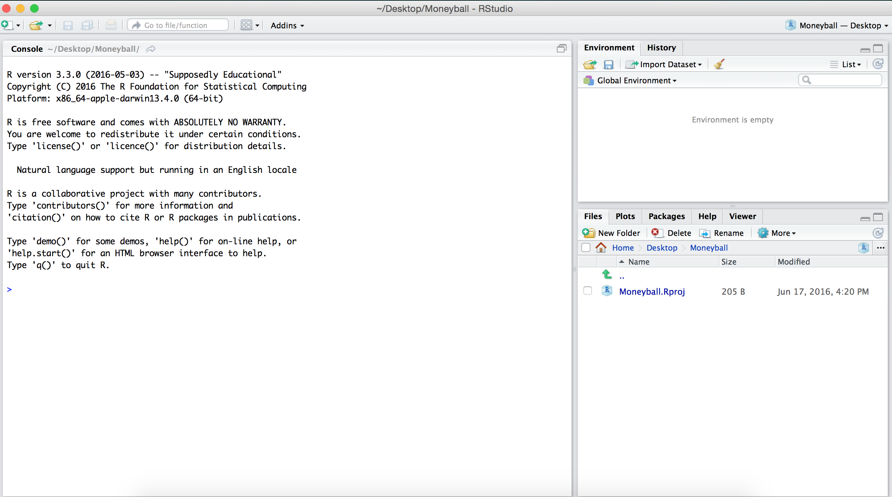

```{r ps0-setup, include=FALSE}
knitr::opts_chunk$set(echo = TRUE)
```

Please try to work through this first problem set 

## Basic Usage
When you open RStudio for the first time, it should open up a new window that looks something like this:


The RStudio window is divided into three panes. For now, we will focus only on the big pane on the left, the **Console** pane.
At the top of the **Console** pane, there is a bit of introductory text that shows the version of R that we are using and the license. 
Below that, you should see a `>`, which is the *R prompt*.
As we mentioned earlier, at its core, R uses a command-line interface which means that you interact with the software by typing commands and hitting <kbd>Enter</kbd> or <kbd>Return</kbd>.

The simplest thing we can do is to use R as a calculator.
For instance, we can type `2 + 3 * (6 - 4)^5` after the `>` and then hit <kbd>Enter</kbd>.
Below, is a code-chunk showing the output of typing `2 + 3 * (6 - 4)^5` after the `>` and then hitting <kdb>Enter</kbd>.
Throughout the course, you should try to replicate the code and output in these code chunks. 

We see that R returns the value of the expression $2 + 3 \times (6 - 4)^5$ immediately underneath and the answer is preceded by a [1]. 
For now, don't worry about this ``[1]''; we'll return to it later.
```{r}
2 + 3 * (6 - 4)^5
```

Like any scientific calculator, R comes with a number of built-in functions
```{r ps0-built-in-functions}
sqrt(4)
log(10)
cos(pi)
```


## Assignment
When you enter expressions like those above, R evaluates them, prints them, and then immediately discards them. Oftentimes, however, you'll want to store a value as a named variable and use it in subsequent calculations. For instance, let's say that we want to store the value of $2 + 3\times (6 - 4)^5$ as $x$ and then compute the following: $1/x, x + 1,$ and $\sqrt{x}.$
To *assign* the value of the expression `2 + 3*(6 - 4)^5` to the variable `x` we use the *assignment operator* `<-`. 
The assignment operator evaluates the expression immediately to the right of it and stores that value in an object whose name is whatever text came to the left of the operator. 
```{r ps0-assignment}
x <- 2 + 3*(6-4)^5
```
Now when we execute this expression, R does not auotmatically print anything like it did in an earlier example.
However, if you look closely at the **Environment** pane (top right-hand side of the RStudio window), you'll see that it now lists x and its value 98. 


This pane will show every variable that we have defined. As we start creating more and more variables, this list will be really helpful to keep track of what we've defined. 
Now that we have created the variable x, we can use the symbol ``x'' in more expressions.
For example, we can compute $1/x, x + 1,$ and $\sqrt{x}$ as follows:
```{r ps0-more-expressions}
x
1/x
x + 1
sqrt(x)
round(3.14159, digits = 2)
round(3.14159, digits = 4)
round(sqrt(x), digits = 4)
```

In the last three examples, we used the function `round()`, which takes 2 arguments (entered inside the parantheses). The first argument is the number that we want to round and the second argument (following the comma) is the number of digits to which we want to round the first argument. 
This is our first example of a multi-argument function and we'll be seeing a lot more of them later on.
In the last example above, we didn't give `round` an explicit number to round.
Instead, R first evaluated `sqrt(x)` and then rounded it.
R follows the conventional order of operations, in that it evaluates the inner-most expression first and then works its way out.

If we try to evaluate an expression using the name of a variable that we haven't defined yet, R will throw an error.
For instance, in the code below, if we try to add 5 to a previously undeclared variable, we get an error.
```{r ps0-error, error=TRUE}
y + 5
```

## Exercises


1. Save the value of `8/5 + 3^3` as a new variable `y`.
2. Save the values of `y/x` as a new variable `z`.
3. Compute the square root of `x`, `y` and `z`.
4. Round these values to 3 decimal points. 

If you've finished these exercises and would like to keep playing with R, you can check out the [first day's R Lecture](lecture1.html).